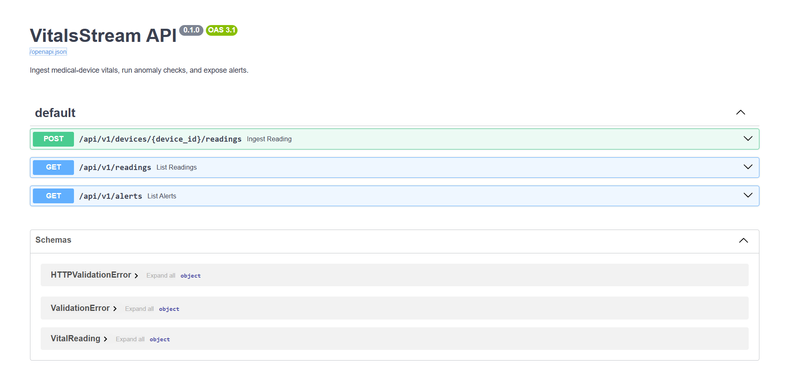

VitalsStream – Medical Device Data Ingestion & Alert API

VitalsStream is a lightweight, end-to-end medical-device data pipeline designed to show how healthcare systems handle real-time vitals ingestion, validation, alerting, and downstream reporting using modern integration patterns.

This project mirrors real workflows used in connected healthcare environments where systems must reliably move data between medical devices, EHRs, and analytics dashboards — across REST APIs, SOAP legacy systems, and SQL-based data stores.

⭐ What This Project Demonstrates

1. **Monitors order & data pipelines in real time**  
   - Tracks orders/events across **multiple systems** (e.g., Shopify, ERP, WMS, marketplace).  
   - Detects **missing, delayed, or duplicated** records before they hit customers or finance.

2. **Reconciles orders across platforms**  
   - Compares **source-of-truth systems** (e.g., Shopify vs ERP).  
   - Highlights **mismatches in totals, statuses, and counts** by day, channel, or store.

3. **Surfaces integration “vitals” in a single dashboard**  
   - High-level **green / yellow / red** status for each integration.  
   - Drill-down views into specific **order IDs, error types, and failure windows**.

4. **Sends proactive alerts when something feels “off”**  
   - Configurable thresholds (e.g., “if Shopify orders ≠ ERP orders by >2%”).  
   - Alerts via **email / Slack / webhook** so teams can jump in fast.

5. **Creates an audit trail for engineering & operations**  
   - Keeps a **history of incidents, anomalies, and resolutions**.  
   - Helps teams **debug faster, document fixes, and prove stability** over time.

6. **Acts as a foundation for automation & self-healing**  
   - Exposes a **clean API layer** for bots/agents to trigger checks, re-runs, and reports.  
   - Can evolve into **auto-replay, auto-repair, or escalation workflows**.

✔️ Healthcare data transmission workflows

Simulates how medical devices send vitals to an integration layer, where data is validated, stored, and prepared for downstream systems such as EMRs, monitoring systems, or dashboards.

✔️ RESTful API ingestion

A clean FastAPI service receives vitals in JSON format with full Pydantic validation.

✔️ SOAP/legacy interoperability mindset

Although this demo uses REST, the code and structure reflect how REST → SOAP or SOAP → REST transformations are handled inside healthcare integration engines.

✔️ Automated anomaly detection

Threshold checks (HR, SpO₂, temperature) generate alerts similar to actual patient-monitoring logic.

✔️ SQL-first thinking

Tables + stored-procedure patterns model how alert pipelines run inside SQL Server or any enterprise database.

✔️ Medical dashboard readiness

Power BI layout (placeholder) shows how device/patient metrics and alert trends would be visualized.

📐 Architecture (High-Level)
Medical Device → REST API → Validation → SQL Storage → Alert Engine → Power BI Dashboard

API Layer: FastAPI with OpenAPI auto-docs

Validation: Pydantic models

Storage: SQL-style schema (device_readings, alerts)

Alerting: threshold-based event engine

Analytics: Power BI (alerts, vitals trends, device health)

📂 Project Structure
vitalsstream-api/
  ├─ app/
  │   ├─ main.py
  │   ├─ models.py
  │   ├─ alerts.py
  │   ├─ db.py
  │   └─ crud.py
  ├─ sql/
  │   ├─ 01_create_tables.sql
  │   ├─ 02_create_alerts_proc.sql
  │   └─ 03_seed_sample_devices.sql
  ├─ tests/
  │   └─ test_api_endpoints.py
  ├─ docs/
  │   └─ api-usage.md
  ├─ powerbi/
  │   └─ VitalsStream_Dashboard.pbix (placeholder)
  ├─ requirements.txt
  └─ README.md

🚀 How to Run
# 1. Install dependencies
pip install -r requirements.txt

# 2. Run API
uvicorn app.main:app --reload --host 0.0.0.0 --port 8000

Open docs:
👉 http://localhost:8000/docs

🔌 Key Endpoints
POST /api/v1/devices/{device_id}/readings

Submit vitals from a device.

GET /api/v1/readings

Fetch all readings (filter by device).

GET /api/v1/alerts

View all generated alerts.

Copy/paste payload example:

{
  "device_id": "ECG-001",
  "patient_id": "P-123",
  "heart_rate": 130,
  "spo2": 90,
  "temperature_c": 38.5,
  "timestamp": "2025-11-28T20:15:00Z"
}

🧪 Testing
pytest

The tests verify:

API validation

Successful ingestion

Alerts generated on abnormal vitals

🏥 Why This Matters in Healthcare Integration

Healthcare still runs on a hybrid world of REST, SOAP, HL7, and SQL-based job pipelines.

VitalsStream demonstrates:

How vitals telemetry is validated and transmitted

How to prepare data for SOAP/EHR systems

How alert logic is triggered server-side

How API → Database → Dashboard pipelines are built in real devices

This repo is intentionally structured like a real medical integration service — readable, maintainable, and ready for extension.
